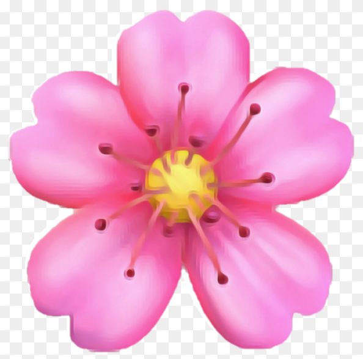
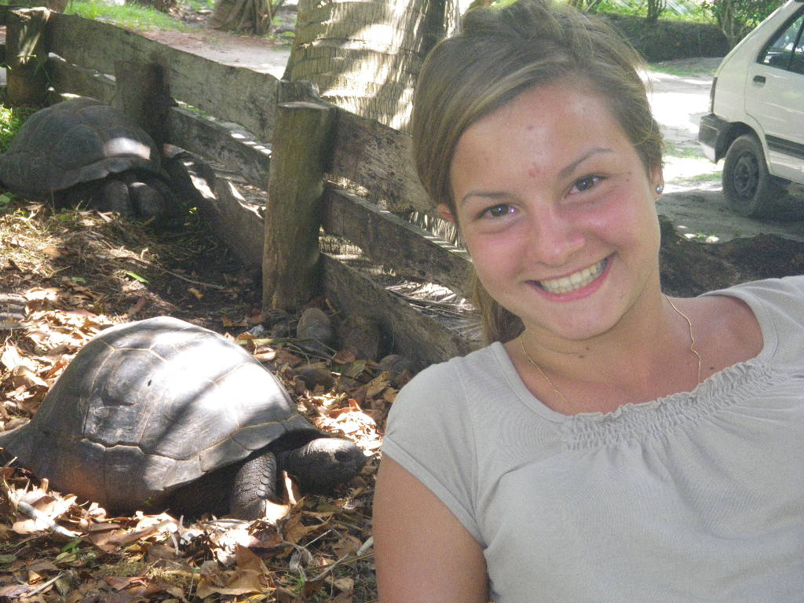
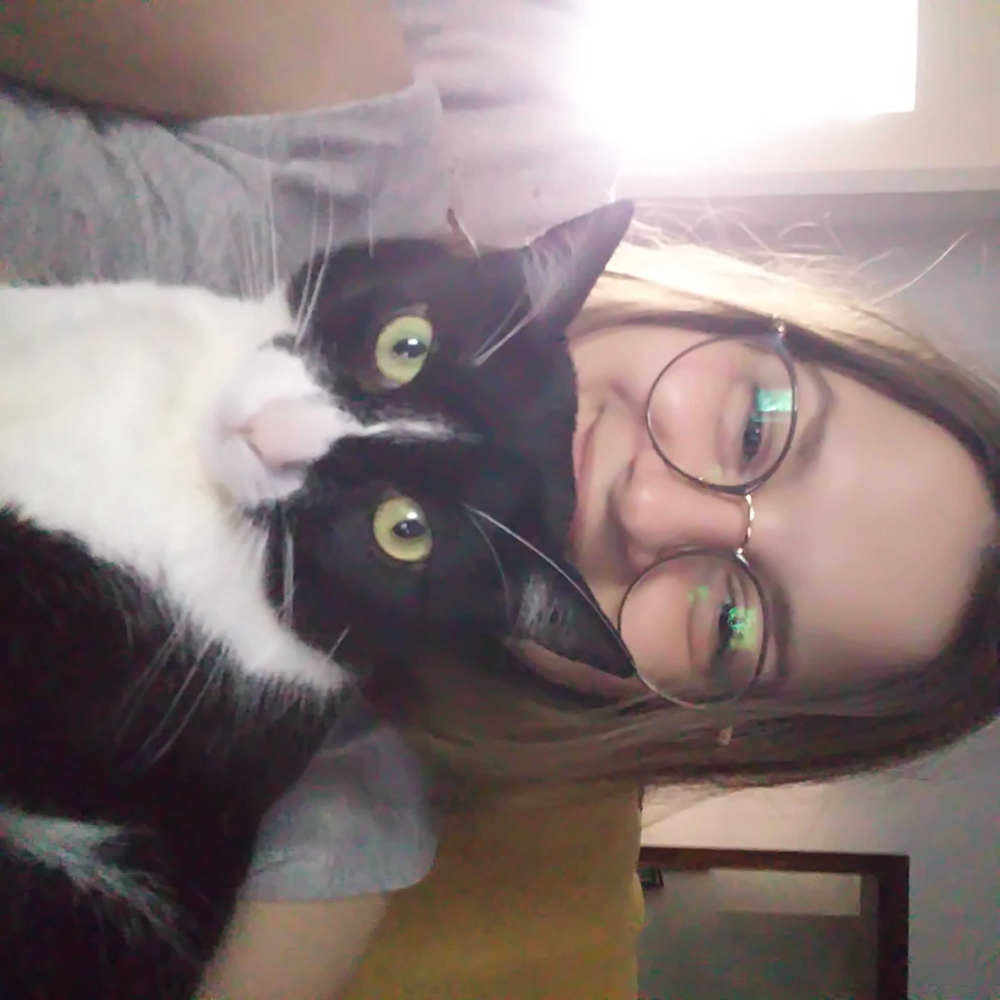

# Mary-pedia
 get ready for some oversharing 

### Early Life
I was born on May 23rd, 1994; in Rome, Italy. My parents decided to call me Maria Carolina out of my mom's aunt's name - they were looking for some regal name bacause of our ancestors.
So, I was born as the youngest daughter of Raimonda and Luca Rinaldi, sister of a 3 years old buddy named Giulio Rinaldi.

As soon as I was 2 years old, we moved to Naples where my mother is from. We were always the closest to my mother's family, even though it has not been easy being the youngest of all cousins - my years in Naples were filled with bullying and shame.
Even though, I think there is something magical about that city, that always makes me wanna go back to get a break from my long-lived relationship with Rome; we moved back here when I was four.
During those years as a kid I learnt how important to me it is the action of taking care, of others, of animals, of situations - I was often called to help in emergency situations. This has never changed. My more lasting hobby ever since has been taking care of small animals, of my cats, of other people interests <i style="font-size:80%"> (it took me a long time to realize I don't need much more than that passion to be valid as a human)</i>.

Another thing I always had a feeling for was English language <i style="font-size:80%">(took me a long time to accept this as a valid passion too...  damn it society!)</i>. I started studying it on my 3rd year of elementary school and luckly enough I had a very fun teacher who helped me falling in love with the subject. She taught me this magical thing of reading, translating and singing English songs, and from then on I never stopped doing so - even though the effort was much more then that in high school. I feel in love with Avril Lavigne, Simple Plan, Eminem even before I was adolescence.

### Youth

And then I went to high school and met this girl. She was italian-american, we became unseparable in a blink of an eye and talked so much about U.S.A. and <a href="#motherhood"> how beautiful would have been living there</a> , and she taught me all about her family's culture and my fascination for American English and the US went to the roof.

Not so much important considering that was the first time I ever fell in love with someone. Yes, it was my "straight" best friend. Cliché. I spent the rest of high school being very empowered by our relationship, it helped me grow a strong personality... until it didn't anymore. It was that kind of relationship that give you everything and takes everything out of you. When I was 17 I moved to Boston with an exchange program, I started looking at other girls in a different way for the first time - she wasn't the only one anymore. I started realizing maybe my sexuality was more than just being in love with her, maybe it was all girls. This distance in space and romatisism broke us good, and from dependent bbf singing to Taylor Swift we became strangers.

That is when I came back to Rome and started going out to queer clubs - there are not a lot in Rome and honestly defenitely the queer scene hasn't grown ever since, but I was 17 and I was happy to not be the only one.

I started dating girls, went to therapy LOL, I entered university. I decided to follow my mother's path - being a psychotherapist. It was my first girlfriend who helped me realize I had a gift not everyone shares. Honestly, all I wanted to do was being rich working as little as possible <i style="font-size:80%">(again, screw you society!)</i>, and if I good at something that seemed like the easiest way. I have never been passionate about psychology though. To me it is more like a language that everybody should understand, or at least that I learnt when I was a child and will never unlearn.

My University years were everything but formative - I moved out of my parents place to go live with my friends, so I was under no control no more.
I skipped so many classes to hang out with friends, I got stoned so much, never study enough to possess in-depth knowledge. Good thing I know how to pass exams without studying. I got myself two degrees and one master without studying. It was just always overwhelming!
I also fell in love for the second time, oh girl how hard it was to get over her - I am such a bottom sometimes! We even got a cat together... She left me for another person when she realized I was dependent. 

Three long years late, I went back to US. I got accepted into a research group at Utah State University and spent one year then. I was 25 and I was happy. I met people who didn't judge as Italians do, I was again free as the Country, I was free from my mental constraints. The only thing is, I was lonely in my own skin - I couldn't stand it for too long. I was and still am scared of feeling lonely  <i style="font-size:80%">(working on it in Analisys, I swear.)</i>.

### ✣✣✣ Covid Break ✣✣✣

### Oh blimey I'm an adult

I was back to Rome, living again in my home with my cat and full of new fears that the pandemic brought. I had a hard time going back to taking a plane, solo travelling, doing things by myself. I am still not sure I can manage to be in public by my self, but turning 29yo helped. Or perhaps meeting love again through my young cat gave me a second chance in living.

In the last 2 years I realized I became an adult without even knowing where my young years have gone, it was really all of a sudden. People started addressing me as "miss" - what the heck!? And great things came with it, because my inner talking became less judmental and I forgive myself more and more. I accepted my not so amazing human being as she is, and I am working towards being a good partner for the next person I will meet <i style="font-size:80%">(and a good ex for the exes that stayed lolol)</i>.

I mean I don't want to be toxic for myself or the others, and I don't care anymore if I have to speak up or either shut out my instincts. I am learning I am valid and, as long as I am respectful of myself and others, I should not be ashamed of who I am.

I am a cats mother without a human child, a lover without someone I am in love with, a friend with not a lot of friends and I haven't figure out my future career - But I know I am free and will get to those things, I know I want to build a queer family and live in a place where I can enjoy water and fruits and talk about myself, that is why I think the most reasonable thing would be moving to Barcelona. I have never thought I could've grown out of my love for U.S.A, I really feel like I belonged there somehow,  <a id="motherhood">but then my motherhood senses started growing </a> and I realized I could never live in a place where I cannot feel safe to have kids and cannot be sure they're protected from firearms.
Let's see if I manage to get a nice job a take myself out of this poor country that Italy is, without the need to have a partner already to support.

And most and foremost, I am not a psychologist, I am a creator. I am a weirdo. I am a person who needs dopamine during work hours and cannot depend on other people's time and money to build the stable life I want. And I am ok with it.

I used to think that the wisest thing to do was to project myself in my 50s and think about what would make me happy then, and how to get there; now that I am hitting my 30s I finally started living in my present, all I care is I am happy <strong>now</strong>, because I can't rely on any moment except for this one.

At least right now I can do the things I love.

