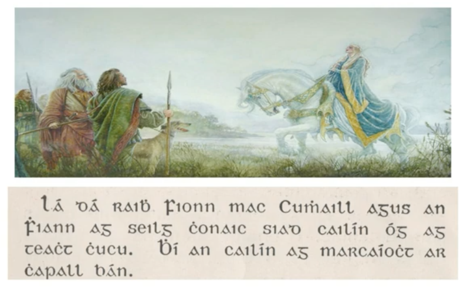
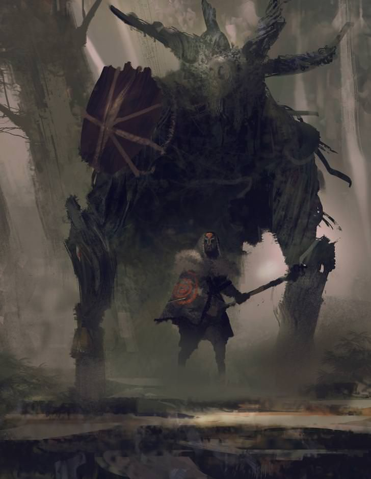
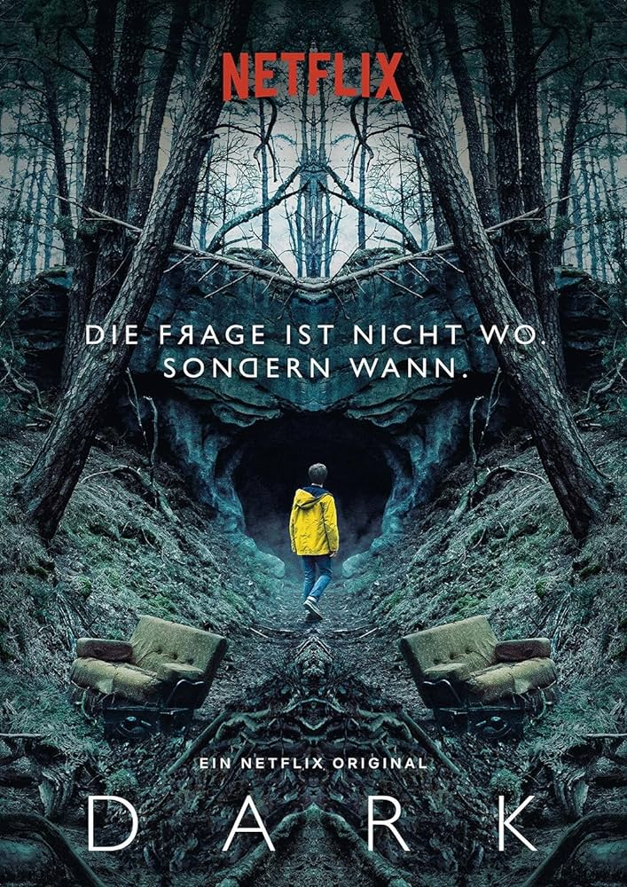

# NIAMH

## Socials

- [My homepage](niamhdoyle.dev)
- [My Twitter](https://twitter.com/niamh_codes)
- [My GitHub](https://github.com/niamh-d)
- [My LinkedIn](https://www.linkedin.com/in/niamh-carolin-doyle-phd-9594a43b/)

## How to pronounce my name

My name is [Irish in origin](https://en.wikipedia.org/wiki/Niamh) and is pronounced "NEE-uv", with stress on the first syllable.

In Irish mythology, [Niamh Chinn Óir (Niamh of Golden-Hair)](<https://en.wikipedia.org/wiki/Niamh_(mythology)>) is the daughter of the god of the sea, Manannán mac Lir (Manannán, son of Lear) – who is thought to have given his name to [the Isle of Man](https://en.wikipedia.org/wiki/Isle_of_Man) – and one of the queens of Tír na nÓg, the land of eternal youth. She is a central character in the relatively well-known story, [Oisín agus Niamh Chinn Óir](https://www.youtube.com/watch?v=c3vfSvce9gw), of which an excerpt can be seen below.

The name means "bright" or "radiant".

## Where I live

I live in [Estonia](https://en.wikipedia.org/wiki/Estonia), a small country of 1.3 million people located south of Finland, north of Latvia, and east of Russia. It is sometimes affectionately nicknamed "E-stonia", due to its public digital infrastructure. The capital is called Tallinn. It's got a beautiful old town, as seen in the photo below:

I live in the second-largest city, Tartu, which is also very pretty, straddling the river Emajõgi, and home to one of the oldest universities in northern and eastern Europe, founded in 1632.

## Programming background

I started learning to code 3 years ago using apps such as Mimo and Grasshopper. I quickly transitioned to Udemy courses and studied Python, building little games and apps. Then I found JavaScript, which I love 😍 I'm presently teaching myself React.js. A sample of my previous work can be found [**here**](https://niamh-codeop-prep.netlify.app/#section-work). Programming tickles my brain and I love the challenge, and then the satisfaction of when things finally work as intended and without error.

## Why I wanted to join CodeOp

I hope to one day soon transition into tech, specifically web development. As a queer woman, I love and support CodeOp's mission to get more women+ into tech.

## Professional history

I'm currently between jobs. I recently finished 8 and a half years at the finance technology company (fintech) [Wise](https://wise.com/), where I led a team of 7 as a senior manager in anti-money laundering compliance, in the testing and monitoring team. Wise facilities cross-border payments and offers a multi-curreny current account, as well as additional financial services.

### Other previous professional roles include:

- French and English languages teacher at a number of secondary schools in Tallinn
- PhD student in Sociolinguistics at Tallinn University, when I studied multilingual family language policy in transnational families
- Proofreader of English-language texts for the Estonian government, various business, academics and students, and the European Commission
- Constructed languages creator (yeah, I actually created a language and script (Nymeran) for an indie comic book called _Glow_)

## Hobbies and Favourite Media

### Tabletop games

One of my hobbies is tabletop games, specifically board games and tabletop (pen & paper) roleplaying games (TTRPGs). My favourite TTRPG is _Symbaroum_, a game of treasure hunting and monster fighting with a haunting, dark aesthetic. These days, I mostly play kid-friendly board games with my kids (soon 10 and just-turned 8).

 

### Favourite songs (some of)

- [On The Nature of Daylight](https://www.youtube.com/watch?v=b_YHE4Sx-08) composed by Max Richter, and which appears in much media, incluse The Handmaid's Tale, Arrival, and The Last of Us.
- [Saoirse ("Freedom")](https://www.youtube.com/watch?v=tKKjixV1U4Y) by Irish group _The Gloaming_, adapted from a poem of the same name by Irish poet Seán Ó Ríordáin.
- [Kauges külas ("In a distant village")](https://www.youtube.com/watch?v=klPcBBRsigk) by Estonian group _Curly Strings_, a song about simple joys and the freedom of youth.

### Favourite TV shows (some of)

- Dark, a German sci-fi show about time, determinism, relationships, and time travel
- The Office (U.S.)
- The Handmaid's Tale
- The Last of Us

### Favourite movies (some of)

- Before Sunrise (1995)
- Before Sunset (2004)
- Arrival (2016)
- Interstellar (2014)
- Le Fabuleux Destin d'Amélie Poulain (2001)
